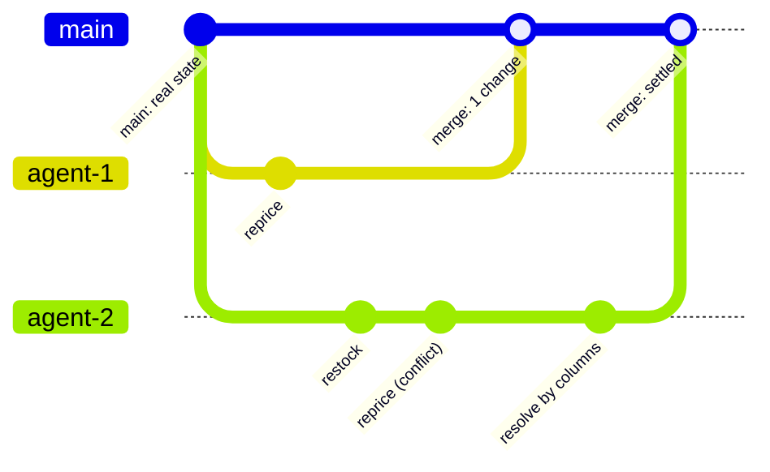
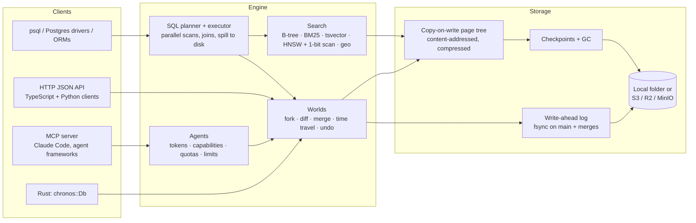

<div align="center">

# Chronos DB

### The database for AI agents: fork the world, try everything, merge what works.

Every agent gets its own copy-on-write **world** (a branch of the whole database) in about **2 microseconds**.<br>
It speaks **Postgres**, searches **filters, text and vectors** in one query, and **merges** changes back with conflicts returned as data.

<br>


[**Docs site**](https://abhishekxdg.github.io/chronosdb/) ·
[**Quickstart**](docs/quickstart.md) ·
[**Concepts**](docs/concepts.md) ·
[**SQL**](docs/sql.md) ·
[**Search**](docs/search.md) ·
[**HTTP API**](docs/http-api.md) ·
[**Operations**](docs/operations.md) ·
[**Benchmarks**](BENCHMARKS.md) ·
[**Changelog**](CHANGELOG.md)

</div>

---

```sql
-- psql postgres://127.0.0.1:5433/main
create world agent_7 with (owner = 'claude', task = 42);   -- instant private copy, any size
switch world agent_7;
update prices set amount = amount * 0.9 where sku like 'SUMMER-%';

select id, title from products                              -- hybrid search sees the world's own edits
where category = 'shoes'
order by embedding <=> $1::vector limit 10;

diff world agent_7;                  -- table, id, change, before, after
merge world agent_7 dry run;         -- what would happen, row by row, and why rows conflict
merge world agent_7;                 -- or: drop world agent_7
```


## Contents

- [Why Chronos DB](#why-chronos-db)
- [At a glance](#at-a-glance)
- [How it works](#how-it-works)
- [Features](#features)
- [Quickstart](#quickstart)
- [Benchmarks](#benchmarks)
- [Correctness and testing](#correctness-and-testing)
- [Status and roadmap](#status-and-roadmap)
- [Feedback and contributing](#feedback-and-contributing)
- [What's in this repository](#whats-in-this-repository)
- [License](#license)

---

## Why Chronos DB

Postgres and SQLite were built for **a few long-lived databases with one shared truth**. Agents work differently:

| Agents need to... | Traditional databases | Chronos DB |
|---|---|---|
| Try something without breaking production | Copy the database (seconds to minutes) or mock it | `fork` in ~2 µs, any size, on disk |
| Run many attempts in parallel | One connection pool, one truth, lock contention | Thousands of isolated worlds, 100,000 tested |
| Review what an agent changed | Audit tables you build yourself | `diff` any two worlds or moments, as rows or as SQL |
| Keep the good work, drop the rest | Hand-written migrations | `merge` (whole, by table, by key, by column) or `drop` |
| Undo a bad agent | Restore a backup and lose everyone's work | `UNDO AGENT bot SINCE '-2 hours'`, row by row |
| Search while working | A separate vector DB that can't see uncommitted edits | Filters + full text + vectors inside every world |
| Stay safe with untrusted agents | Roles and hope | Per-agent capabilities, quotas, time and memory limits; humans approve merges |

---

## At a glance

Headline numbers against the best rival measured on the same machine. Every row links to its method; **losses are listed too**.

| Workload | Chronos DB | Best rival measured | |
|---|---|---|---|
| Fork a 100k-row database for an agent | **~1–2 µs** | Dolt 40 ms · Postgres ~10 s (template DB) | [§1](BENCHMARKS.md#1-forks-and-concurrent-writes-phase-1-kill-gate-10-postgres) |
| 1,000 agents each fork, write 1,000 rows, merge (on disk, Linux) | **220k rows/s** | Dolt 20.5k rows/s (**11×**) · Postgres 1.9k rows/s | [§1](BENCHMARKS.md#1-forks-and-concurrent-writes-phase-1-kill-gate-10-postgres) |
| Merge p50, 1,000 agents at 25 workers (Linux) | **46 ms** | Postgres 17: 1,157 ms | [§8](BENCHMARKS.md#8-the-losses-rerun-on-linux) |
| Vector search, 76k real OpenAI embeddings (1,536-d), p50 / recall@10 | **1.00 ms / 99.98%** | LanceDB 1.71 ms / 85.4% · pgvector 4.06 ms / 82.5% · Qdrant 5.14 ms / 93.6% | [§6](BENCHMARKS.md#6-vector-search-vs-other-vector-databases-on-real-embeddings) |
| Filtered vector search, 500k × 384, p50 | **0.17–2.0 ms** | tuned pgvector 9.2–93 ms (**24–64×**) | [§2](BENCHMARKS.md#2-vector-search-vs-postgres--pgvector-phase-1-kill-gate-5-pgvector) |
| Hybrid search (filter + text + vector), 1M rows, p99 | **~2 ms**, the same inside a fork | — | [§3](BENCHMARKS.md#3-hybrid-search-inside-branches-phase-3-targets-p99--5-ms-at-1m-fork-within-10-of-main) |
| Durable single-row commits (Linux, fsync on both) | **644–806 /s** | Postgres 17: 591–656 /s | [§8](BENCHMARKS.md#8-the-losses-rerun-on-linux) |
| Join + `GROUP BY`, 200k rows per table | **29.4 ms** | Postgres 16: 47.8 ms | [§4](BENCHMARKS.md#4-sql-over-the-postgres-protocol) |
| 100,000 live worlds | **2.2 µs** fork · **456 B** disk per world | — | [§9](BENCHMARKS.md#9-many-worlds-10-to-100000) |

> [!NOTE]
> Sections 1–7 and 9–12 ran on an 8 GB Apple M2 laptop; sections 8 and the Dolt/DuckDB races on a GCP e2-highmem-4 (4 vCPU, 32 GB). They are engineering numbers, not a published benchmark. Methods and results for each are in [BENCHMARKS.md](BENCHMARKS.md).

---

## How it works



**Worlds are copy-on-write.** A world is a pointer to an immutable, content-addressed tree of pages. Forking copies the pointer, not the data, so it costs the same ~2 µs at 1,000 rows or 1 million. A world then pays only for what it changes (about 450 bytes on disk for one changed row).

**Merges are three-way and exact.** A merge diffs the world against its fork point, skipping every subtree both sides share, and applies each changed row. If both sides changed the same row, the merge stops and returns the conflicts as data, even when the values happen to match. You then settle them: `USING OURS/THEIRS`, row by row, or `BY COLUMNS` when the two sides touched different columns. Partial merges (`ONLY TABLES`, `ONLY KEYS`) and merges into another world (`INTO`) are logged exactly, so replay after a crash gives the same result.



**Search indexes are shared.** Indexes are built for anchor states and shared by every world forked from them. A world searches the anchor's index minus the keys it changed, plus its changed rows scored directly. That is why a query inside one of 100,000 worlds runs as fast as in `main`.

---

## Features

<table>
<tr>
<td width="50%" valign="top">

### 🌍 Worlds (branches of everything)
- `CREATE / FORK / SWITCH / DROP WORLD`, with JSON metadata, owners and IDs
- Worlds of worlds, to any depth (10,000 deep tested)
- `DIFF` between any two worlds or moments, as rows or as runnable SQL
- `MERGE`: whole, `DRY RUN`, `ONLY TABLES`, `ONLY KEYS`, `INTO` another world, `BY COLUMNS`, per-row `RESOLVE`
- **Time travel:** `SELECT ... AS OF '-1 hour'`, `RESTORE WORLD`, `UNDO MERGE` (30-day retention by default)
- **Undo an agent:** `UNDO AGENT bot SINCE '-2 hours' SKIP CHANGED`
- **Simulations:** `SIMULATE 1000 WORLDS ... RUN $$...$$ SCORE $$...$$ KEEP 10 SEED 42`, deterministic and replayable
- `SHOW STORAGE` per world, `SET TTL`, idle-world sweep, pinned worlds

</td>
<td width="50%" valign="top">

### 🐘 Postgres, for real
- Postgres wire protocol: `psql`, drivers, ORMs, prepared statements, `COPY`, `LISTEN/NOTIFY`
- Joins (inner/left/right/full), subqueries, CTEs, `WITH RECURSIVE`, window functions
- Unique, foreign-key (multi-column, cascade) and `CHECK` constraints; `ON CONFLICT` upserts
- Views, materialized views, sequences, enums, temp tables, schemas, `information_schema` / `pg_catalog`
- **PL/pgSQL** functions and triggers, with `EXCEPTION` blocks and `EXECUTE`
- JSONB, arrays, regex, dates/intervals, numeric `to_char`, `SIMILAR TO`
- Transactions, savepoints, `statement_timeout`, `EXPLAIN`
- Checked against real Postgres 17 by a differential test suite (`tests/pgdiff.rs`)

</td>
</tr>
<tr>
<td valign="top">

### 🔎 Search, inside every world
- **Vectors:** pgvector-compatible `vector(N)`, `<=>` `<->` `<#>`, `USING hnsw`. Runs [Mem0](https://github.com/mem0ai/mem0)'s pgvector store unchanged
- HNSW graph built in the background, tuned per graph, used only when it proves ≥ 99% recall against exact search; otherwise an exact 1-bit scan with full-precision rescoring
- **Full text:** Postgres `tsvector` / `tsquery`, `ts_rank`, `websearch_to_tsquery`, English Snowball stemmer (identical on 20,000 words), GIN indexes
- **BM25 + typo tolerance + fusion:** `search('table', 'words')`, and `find ... where ... match ...`
- **Geo:** PostGIS points, `ST_DWithin`, exact WGS84 geodesic `ST_Distance`, `USING gist`, nearest-first `<->`
- **Graphs:** recursive traversals driven by indexes (4 hops over 200k edges: 30 ms to 1 ms)

</td>
<td valign="top">

### 🤖 Built for agents
- **MCP server:** `claude mcp add chronos -- chronos mcp mydb`, with `fork`, `diff`, `merge_preview`, `checkpoint`, `rollback` and more
- **Safe by default:** agents change only worlds they forked; a person approves merges (`--allow-merge` to opt out)
- **Agent accounts:** tokens (blake3-hashed), capabilities (`read`, `fork`, `write_own`, `merge_own`, `admin`...), quotas (worlds, changes, writes per minute)
- **Per-agent limits:** `max_query_ms`, `max_concurrent`, `max_memory_mb`
- **Server-wide:** `statement_timeout`, `max_worlds`, `world_idle_ttl`; `serve --safe --admin-token`
- One folder shared by many processes: the first opener serves the rest
- Examples for Claude Code, LLM tool definitions and parallel agents in [`examples/agents`](examples/agents)

</td>
</tr>
<tr>
<td valign="top">

### 💾 Storage and durability
- Write-ahead log with `fsync` (macOS `F_FULLFSYNC`) on `main` and merges before they return
- Branch writes are fast, and loss is never silent: versions are checked on merge
- LZ4-compressed, content-addressed pages; background checkpoints and garbage collection
- `synchronous_commit = normal | off` when you trade safety for speed
- Page cache with a hard memory cap; databases many times bigger than RAM
- Encryption at rest, backups, and **S3 / R2 / MinIO** storage with a single-writer lease and scale-to-zero (`--features s3`)

</td>
<td valign="top">

### ⚡ Speed
- Scans, hash joins and `GROUP BY` split across every core
- Joins stream: each core joins and groups its part without holding either side whole
- Sorts on every core; `ORDER BY ... LIMIT k` keeps only k rows
- **Spills to disk** past `CHRONOS_WORK_MEM`: `GROUP BY`, `DISTINCT` aggregates, `ORDER BY`, grace hash joins, and the writes of a big `INSERT`, `UPDATE`, `DELETE` or `COPY`, which stays one atomic statement
- Packed binary rows, prepared plans cached per schema version
- AVX2 dot products and `POPCNT` 1-bit vector scans
- `SHOW METRICS`: count and p50 / p95 / p99 latency per operation, plus counters

</td>
</tr>
</table>

---

## Quickstart

### Install

A prebuilt binary for macOS or Linux (x86_64 and arm64), checked against the release's SHA-256 sums, into `~/.local/bin`:

```bash
curl -fsSL https://github.com/Abhishekxdg/chronosdb/releases/latest/download/install.sh | sh
chronos --version
```

`CHRONOS_VERIFY=1` also checks the release's signature with [cosign](https://docs.sigstore.dev/cosign/system_config/installation/).

### Postgres: psql, drivers, ORMs

```bash
chronos serve mydb                              # HTTP on :7070, Postgres on :5433
psql postgres://127.0.0.1:5433/main
```

Every world is also a database name: `psql postgres://127.0.0.1:5433/agent_7`.

### The shell

```text
$ chronos mydb
chronos:main> put users 1 {"name": "Ada", "role": "admin"}
chronos:main> fork agent-7                       # instant private copy
chronos:agent-7> put users 1 {"name": "Ada L.", "role": "admin"}
chronos:agent-7> diff
1 change on agent-7
~ users/1  name: "Ada" -> "Ada L."
chronos:agent-7> merge
merged 1 change from agent-7 into main; now on main
chronos:main> find users where role = admin match ada
```

### TypeScript and Python (one file each, no dependencies)

```ts
import { Chronos } from "./clients/typescript/chronos";

const db = new Chronos("http://127.0.0.1:7070");
const agent = await db.fork("agent-7");
await agent.put("users", "1", { name: "Ada L.", role: "admin" });
console.log(await agent.diff());
await agent.merge(); // throws ChronosError 409 on conflicts, or if a crash lost writes
```

```python
from chronos import Chronos

agent = Chronos("http://127.0.0.1:7070").fork("agent-7")
agent.put("users", "1", {"name": "Ada L.", "role": "admin"})
agent.merge()
```

### Chronos Studio: a web UI, built in

```bash
chronos studio mydb        # opens the Studio in your browser, on 127.0.0.1 only
```

Worlds as a tree, each table's rows in a fast grid (filters, sorting, any table as of any moment), a row inspector, a SQL console, and the Changes view where you review a world's changes, preview the merge with conflicts explained, and merge into main (or discard, or undo). Edits on main offer to go into a new world first. Agents, the audit log and status are one menu away; ⌘K does the rest. It's in every install, runs beside a running `chronos serve` on the same folder, and a per-run key in the link keeps other pages and programs out. See [docs/studio.md](docs/studio.md), which also covers working on the UI (`npm run dev` in `studio/`).

### Claude Code and other MCP agents

```bash
claude mcp add chronos -- chronos mcp /path/to/mydb
```

The agent can describe, search, query, fork, write, diff and preview merges. **A person merges** unless you pass `--allow-merge` or give an agent account that right.

### Bring your data

```bash
psql postgres://127.0.0.1:5433/main -c "\copy orders from 'orders.csv' csv header"
chronos import mydb orders orders.csv --schema schema.csv    # a Postgres table, schema and all
chronos mydb migrate ./migrations                            # apply numbered .sql files once each
```

---

## Benchmarks

The full record, with methods, raw tables and every caveat, is in **[BENCHMARKS.md](BENCHMARKS.md)**. Highlights:

### Forks and concurrent agents

1,000 agents each fork `main` (100k seed rows), write 1,000 rows and merge back.

| agents | system | fork p50 | merge p50 | total | agent rows/s |
|---:|---|---:|---:|---:|---:|
| 1,000 | **Chronos DB** (in memory, M2) | **0.001 ms** | 736 ms¹ | **1.6 s** | **631k** |
| 1,000 | **Chronos DB** (on disk, M2) | | | | **365k–646k** |
| 1,000 | SQLite (file copy + `EXCEPT` merge) | 12,097 ms | 14,703 ms | 730 s | 1.4k |
| 1,000 | Postgres 16 (`CREATE DATABASE ... TEMPLATE`) | 10,388 ms | 348 ms | 533 s | 1.9k |

Against **Dolt 2.3.5**, the only other database with real merges (Linux VM, real `DOLT_MERGE`, batched inserts):

| agents | Chronos DB on disk | Dolt | |
|---:|---:|---:|---:|
| 10 | 275k rows/s | 15.5k rows/s | **18×** |
| 100 | 270k rows/s | 15.4k rows/s | **18×** |
| 1,000 | 220k rows/s | 20.5k rows/s | **11×** |

¹ Merges into `main` queue behind each other; with one thread per agent, 1,000 queue at once. At Postgres's 25 workers the Chronos median is **46 ms vs Postgres's 1,157 ms** ([§8](BENCHMARKS.md#8-the-losses-rerun-on-linux)).

### Vector search on real embeddings

76,424 OpenAI embeddings (1,536-d, DBpedia) + 500 queries, top 10, each system at its defaults. Chronos DB is queried over SQL exactly as Mem0's pgvector store queries it.

| system | all rows p50 | recall@10 | one user (1%) p50 | recall@10 |
|---|---:|---:|---:|---:|
| **Chronos DB** (SQL, pgvector syntax) | **1.00 ms** | **99.98%** | **0.75 ms** | 100% |
| LanceDB (embedded, IVF_HNSW_SQ) | 1.71 ms | 85.4% | 2.44 ms | 97.1% |
| Chroma (embedded) | 3.44 ms | 93.3% | 75.5 ms | 100% |
| Postgres 17 + pgvector 0.8.4 | 4.06 ms | 82.5% | 10.1 ms | 100% |
| Qdrant 1.19 (Docker) | 5.14 ms | 93.6% | 4.22 ms | 100% |

Synthetic 500k × 384 against **tuned** pgvector (`shared_buffers = 2GB`, `ef_search = 300`, iterative scan):

| filter keeps | Chronos p50 | pgvector p50 | Chronos recall | pgvector recall |
|---|---:|---:|---:|---:|
| all rows | 2.0 ms | 47.7 ms | 100% | 97.2% |
| 10% | 1.5 ms | 93.1 ms | 100% | 97.0% |
| 1% | 0.50 ms | 20.2 ms | 97.3% | 80.0% |
| 0.1% | 0.17 ms | 9.2 ms | 100% | 100% |

### Hybrid search inside a fork (1M rows)

| query | main p50 | main p99 | fork ÷ main |
|---|---:|---:|---:|
| filter (1%) | 0.02 ms | 0.03–0.12 ms | 0.92–1.09× |
| text | 0.27 ms | 0.7–1.2 ms | ~0.8× |
| vector + filter (20%) | 0.7–0.8 ms | 1.2–4.3 ms | 0.83–1.05× |
| filter + text + vector | 0.85–1.0 ms | 1.7–2.2 ms | 0.88–1.17× |

### SQL over the Postgres protocol

200,000 rows per table, ms per query (M2, 8 cores; Postgres 16 with its default parallel workers):

| query | Chronos, 1 core | **Chronos, 8 cores** | Postgres |
|---|---:|---:|---:|
| `count(*)` | 15.9 | **4.8** | 6.8 |
| `count(*) WHERE amount > 500` | 30.0 | **6.6** | 8.4 |
| `GROUP BY` with `count`, `max` | 55.5 | **15.1** | 45.6 |
| join, then `GROUP BY` with `sum` | 123.9 | **29.4** | 47.8 |
| join `WHERE name LIKE 'user 1%'` | 107.1 | **22.5** | 29.4 |

OLTP at equal durability (Linux, `fdatasync` on both): **644–806 commits/s** vs Postgres's 591–656; key join **71 µs** vs 92 µs.

### 100,000 worlds

| worlds | fork p50 | point query main / world | disk per world | memory per world |
|---:|---:|---:|---:|---:|
| 1,000 | 2.1 µs | 30 / 20 µs | 442 B | 2.5 KB |
| 10,000 | 2.1 µs | 21 / 31 µs | 449 B | 3.2 KB |
| 100,000 | 2.2 µs | 17 / 16 µs | 456 B | 3.8 KB |

### The ultimate test: 300,000 simulated futures, one merge

A real supply chain lives in `main`. **100,000 worlds** each simulate their own reorder policy in SQL (`WITH RECURSIVE` over days of demand), are scored in SQL, and the best 1% fork 100 children each, for three rounds. The winning policy is merged back into `main`: **+32.2% profit** over today's policy, in about **21 minutes on an 8 GB laptop**, and the same winner on every run with the same seed ([§10](BENCHMARKS.md#10-the-ultimate-test-one-real-state-100000-worlds-a-learning-loop-one-merge)).

Also measured: **Monte Carlo Tree Search** where every tree node is a world (Connect Four, 49,402 worlds, ~1 ms per iteration, 20–0 against a random player, [§11](BENCHMARKS.md#11-monte-carlo-tree-search-over-worlds)), and a database **25× bigger than its cache** at a 188 MB peak footprint ([§12](BENCHMARKS.md#12-a-database-bigger-than-its-cache)).

### Where Chronos DB loses (today)

| workload | result | why / plan |
|---|---|---|
| Analytics vs **DuckDB 1.5.5** (200k-row reports, 4 threads) | DuckDB **4–15× faster** | DuckDB is a columnar OLAP engine; Chronos stores rows. Columnar storage is not planned for v0.1 |
| Bulk vector load vs LanceDB | Chronos 20.0 s vs LanceDB **2.0 s** | LanceDB takes an in-process Arrow table; Chronos gets rows over the wire. Index build halved since; binary vectors landed but not yet rerun; a `COPY FROM STDIN` vector path is next |
| Fork p50 at 1,000 agents on 4 vCPUs | Chronos 59 ms vs Dolt 26 ms | 1,000 OS threads on 4 cores; at normal concurrency a fork is ~2 µs |
| Checkpoint / reopen at 100,000 worlds | 8.3 s / 3.5 s | Grows faster than linear; measured on a loaded machine, needs a quiet rerun |

---

## Correctness and testing

| Check | What it does | Result |
|---|---|---|
| **Test suite** | 42 integration suites + unit tests, run on Linux | **350+ passed, 0 failed** |
| **Crash suite** | Cuts the log at random bytes with torn writes, then recovers (`CRASH_RUNS=10000`) | 10,000 / 10,000 recover exactly what reached disk |
| **Deterministic simulation** | [shuttle](https://github.com/awslabs/shuttle) explores concurrent schedules of agents, writes, checkpoints and GC | Passes 3,000 schedules; failing schedules replay exactly |
| **Jepsen-style** | `kill -9` the server during concurrent fork/merge bank transfers | 300 kills, 108,178 transfers, none lost, every balance matches |
| **Postgres differential** | Same queries on Chronos DB and real Postgres 17, results compared | Functions, types, errors and formatting match |
| **Capability audit** | 30 end-to-end capability checks, executed | 27 pass, 3 partial (being closed) |

The Jepsen-style test found two real bugs before this release (money created by a merge that treated equal values as no conflict, and a silent loss after a fast restart), and both are fixed. See [BENCHMARKS.md §5](BENCHMARKS.md#5-crash-safety).

---

## Status and roadmap

Chronos DB is a **working engine at v0.1**, about to be released, and not yet used in production.

- [x] Worlds: fork, diff, three-way merge, partial merges, time travel, undo
- [x] Postgres wire protocol and a broad SQL surface, checked against Postgres 17
- [x] Schemas, `search_path`, `::regclass`, `pg_index` / `pg_constraint` and the `information_schema` constraint views
- [x] PL/pgSQL `EXCEPTION` blocks, `EXECUTE`, `ALTER TYPE` for enums
- [x] Hybrid search: B-tree, BM25, full text, pgvector + HNSW (graded against exact search), PostGIS points
- [x] Agents: MCP, accounts, capabilities, quotas, per-agent limits, safe mode, `SIMULATE` / `REPLAY`
- [x] Durability: WAL, crash suite, shuttle, Jepsen-style kills; S3 storage
- [x] Parallel execution and spill to disk
- [x] Bounded memory for big work: `CREATE INDEX` / `ADD UNIQUE`, one big `INSERT` / `UPDATE` / `DELETE` / `COPY` (atomic), `DISTINCT` aggregates
- [x] Chronos Studio, built in: worlds and the worldline, data grid with in-place editing, import and export, schema diagram, SQL, hybrid and vector search with a map of the vector space, changes and merges, history and checkpoints, simulations, agents, settings
- [x] Fixes from three full code reviews: parser and regex recursion limits, caps on user-controlled sizes, lock poisoning after a panic, Origin and Host checks on the loopback HTTP API, hardened spill files
- [ ] **Now:** first tagged release (v0.1.0): signed binaries for macOS and Linux
- [ ] **Next:** a plain scan's memory stays flat as tables grow (today ~70 MB at 4M rows, ~200 MB at 10M)
- [ ] Faster bulk vector ingest (`COPY FROM STDIN` with binary vectors; 20 s vs LanceDB 2 s today)
- [ ] A fourth full code review, before an outside one
- [ ] Neon branching benchmark (Dolt and DuckDB done; waiting on a Neon API key)
- [ ] Outside review of the storage code, design partners

See [CHANGELOG.md](CHANGELOG.md) for everything that has shipped, and [SECURITY.md](SECURITY.md) to report a vulnerability.

---

## Feedback and contributing

- **Questions or ideas?** Ask in [Discussions](https://github.com/Abhishekxdg/chronosdb/discussions).
- **Found a bug, or something unclear?** [Open an issue](https://github.com/Abhishekxdg/chronosdb/issues/new/choose): the templates ask for the few lines that reproduce it.
- **Security issues:** privately, as [SECURITY.md](SECURITY.md) says.
- **Contributing:** see [CONTRIBUTING.md](CONTRIBUTING.md).

## What's in this repository

The Chronos DB engine is closed source; this repository holds everything around it:

- **Releases:** signed `chronos` binaries for macOS and Linux, and `install.sh`.
- **[`studio/`](studio):** Chronos Studio's source, the web UI built into every release (React, TypeScript, Vite). See [docs/studio.md](docs/studio.md#developing-the-studio) to work on it.
- **[`clients/`](clients):** the TypeScript and Python clients, one file each, no dependencies.
- **[`docs/`](docs)** and **[`site/`](site):** the documentation, published at [abhishekxdg.github.io/chronosdb](https://abhishekxdg.github.io/chronosdb/).
- **[`examples/`](examples):** SQL walkthroughs and agent tool definitions.

## License

- **The Studio, the clients, the docs site and the examples** (everything in this repository): the [MIT License](LICENSE).
- **The `chronos` binaries:** free to use, including in production, except to offer Chronos DB as a hosted or managed database service. See [TERMS.md](TERMS.md).
